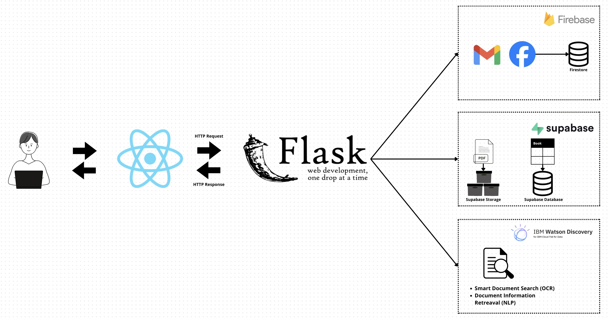
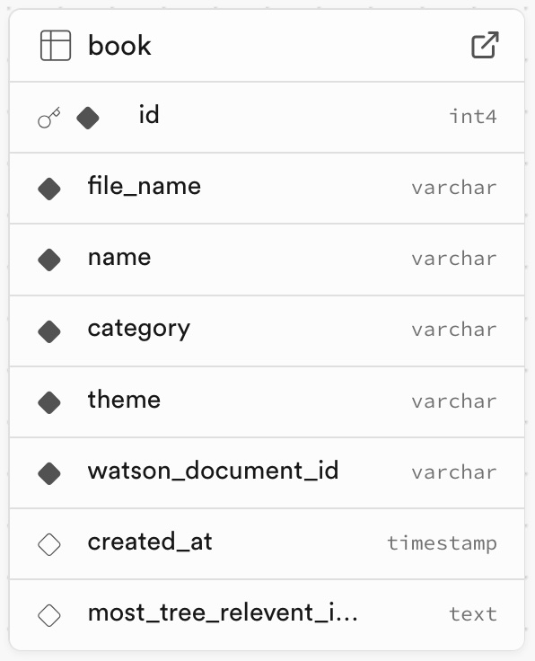

# Online Documents Library
With a main goal of using as many cloud providers' services as possible, the project is a simple online library app built in a client-server architecture with a React.js web client and a Flask web server, connected to **Firebase** for authentication, **Supabase** for database and storage, and **IBM Watson Discovery** for smart document search and info retrieval.

  

  

